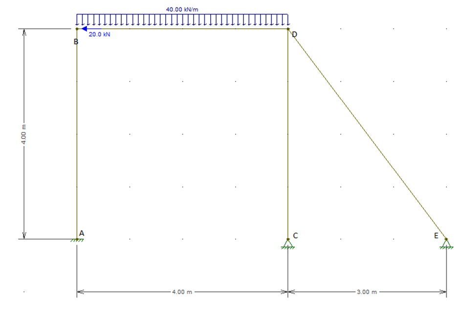
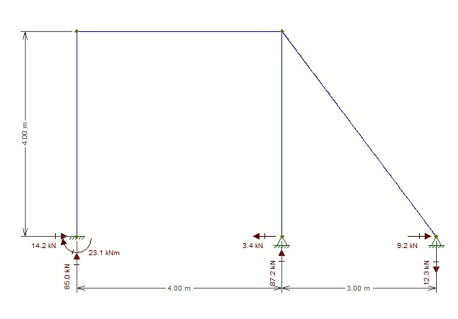

# Análise Linear Matricial de Pórtico Plano  

Este trabalho apresenta uma análise matricial detalhada de um pórtico hiperestático (uma estrutura com mais restrições do que o necessário para o equilíbrio estático), com o objetivo de compreender seu comportamento sob diferentes tipos de carregamento.  

## Metodologia  

A metodologia central envolve:  
- **Discretização do pórtico** em elementos de barra.  
- **Cálculo das matrizes de rigidez local**, que representam a resistência de cada elemento à deformação, com base nas propriedades do material (módulo de elasticidade, área da seção transversal, momento de inércia) e nas dimensões geométricas.  
- **Aplicação de matrizes de rotação** para transformar as rigidezes locais em um sistema de coordenadas global, considerando a orientação de cada barra.  
- **Montagem da matriz de rigidez global**, que descreve a rigidez total do pórtico.  

## Solução e Validação  

Com a matriz de rigidez global estabelecida e os carregamentos aplicados (distribuídos e concentrados), o sistema de equações é resolvido para determinar:  
- **Deslocamentos nodais** (movimentos em cada ponto de conexão da estrutura).  
- **Reações de apoio**.  

A solução numérica obtida através do código Python foi **validada por comparação com resultados de softwares comerciais** (Ftool e Smath Solver), garantindo a precisão dos resultados.  

## Análise de Resultados  

O trabalho inclui:  
- **Esforços internos** (forças normais, cortantes e momentos fletores) em cada barra.  
- **Visualização da estrutura deformada** em relação à sua configuração original.  
- Identificação das **barras mais rígidas** e interações entre graus de liberdade.  
- Confirmação de que os **deslocamentos são pequenos**, característico de estruturas com alta rigidez.  

## Exemplos Visuais

<div align="center">

### Estrutura e Carregamentos


### Reações de Apoio


</div>

## Instruções de Uso

### Pré-requisitos
- Python 3.8 ou superior instalado
- Bibliotecas necessárias: numpy, matplotlib (instale com `pip install numpy matplotlib`)

### Como executar o código
1. Clone ou baixe este repositório.
2. Navegue até a pasta do projeto no terminal:
   ```bash
   cd "Caminho/para/Analise linear"
   ```
3. Execute o script principal:
   ```bash
   python "Análise linear matricial de pórtico plano.py"
   ```
4. Os resultados serão exibidos no terminal e, se aplicável, gráficos serão gerados na tela ou salvos como arquivos de imagem.

### Observações
- Certifique-se de que as imagens de entrada/saída estejam na mesma pasta do script, se necessário.
- Para modificar os parâmetros do pórtico, edite as variáveis no início do arquivo Python.

## Colaboração  

**Observação importante:** Este projeto foi desenvolvido em colaboração com uma aluna da UEFS, graduanda em Engenharia Civil, combinando conhecimentos teóricos e práticos para uma análise robusta e validada.  

Em suma, o estudo oferece uma **compreensão abrangente** do comportamento do pórtico sob carga, com validação por diferentes abordagens computacionais.  

---  
**Repositório GitHub**  
Acesse os códigos, dados e resultados detalhados neste repositório.  

